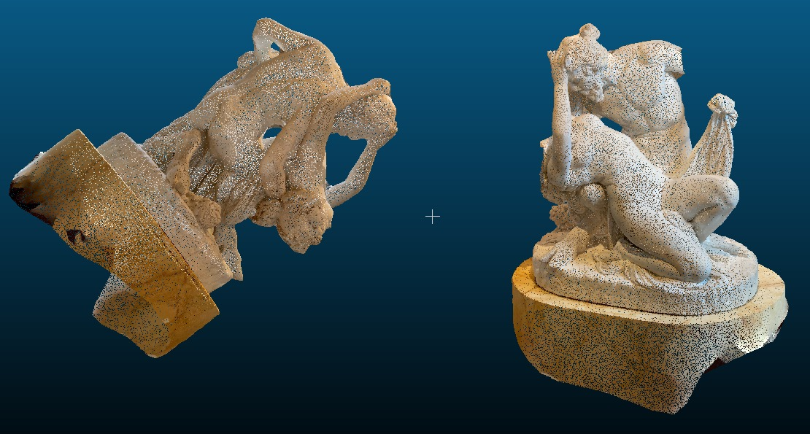
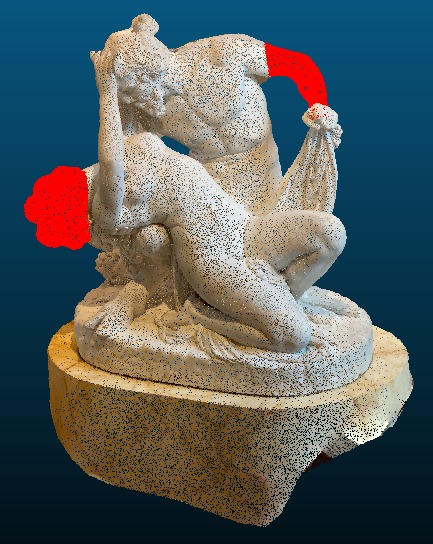
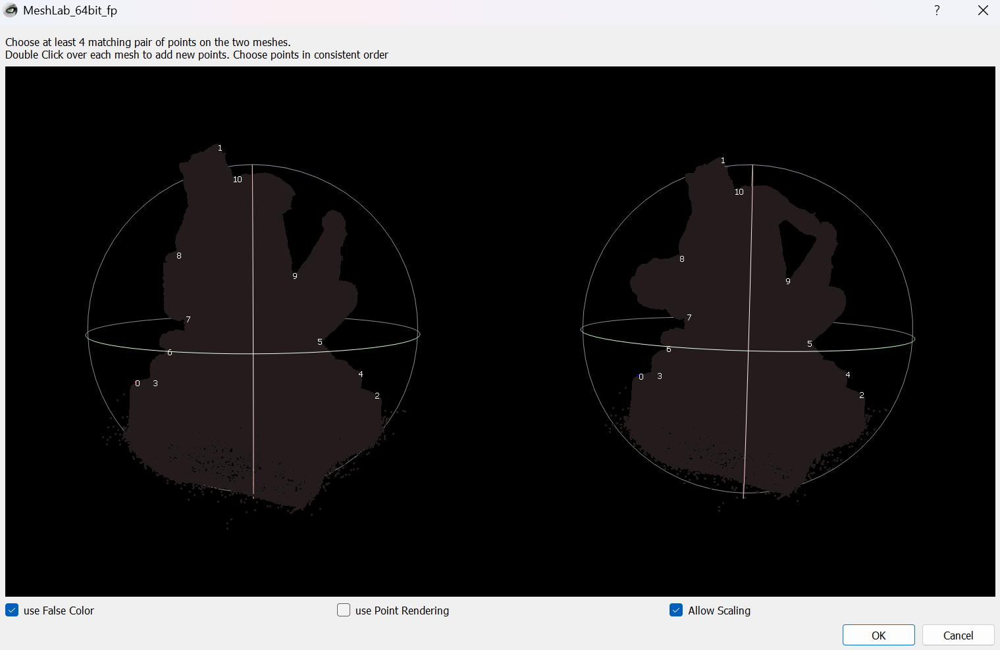
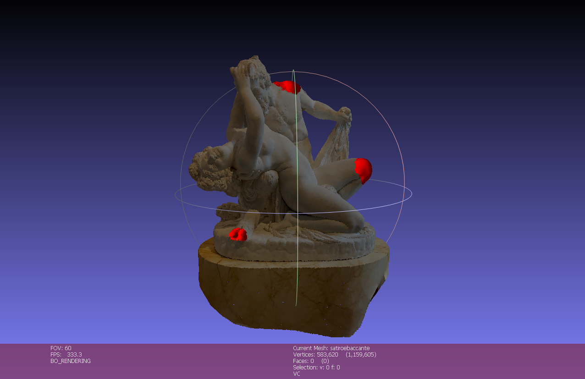
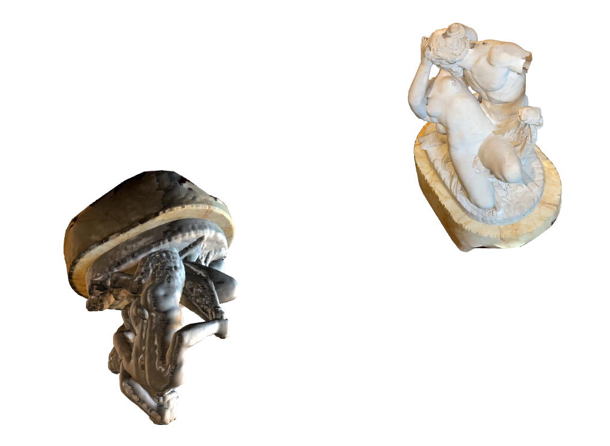
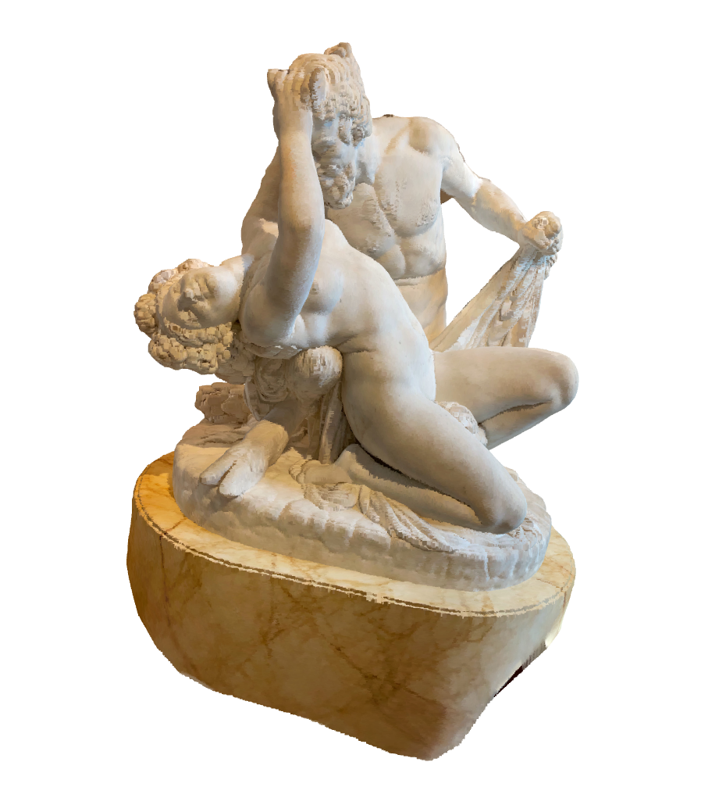
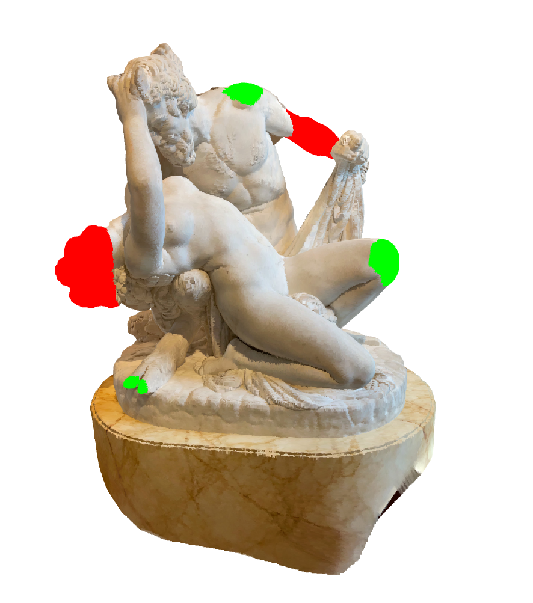
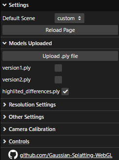
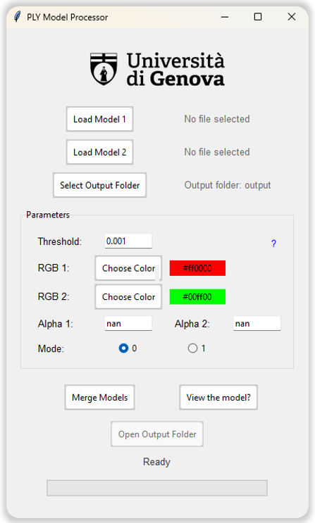

# 3D Gaussian Splatting Project
This **Temporal 3D Reconstruction of Cultural Heritage using Gaussian Splatting** focuses on leveraging advanced Gaussian Splatting (GS) techniques to model and visualize temporal changes in cultural heritage sites. The objective is to capture and highlight transformations caused by natural degradation or environmental factors over time. Through innovative visualization techniques, the project aims to create a "time capsule" model that preserves and analyzes these sites, contributing to their long-term digital preservation.

## Model Processing

For merging 3D models, we explored three different methods: **CloudCompare**, **MeshLab**, and a custom **Python** solution. All methods are based on the **Iterative Closest Point (ICP)** algorithm or the **Point Pairs Picking technique**, which align models by iteratively minimizing the distance between corresponding points. Below are the dedicated repositories for each method:
- [**CloudCompare**](https://github.com/LorenzoMesi/AVR-CloudCompare): This repository contains instructions for using CloudCompare to align and merge 3D models.
- [**MeshLab**](https://github.com/biaperass/ICP_Merging_Meshlab): This repository contains detailed steps and documentation for performing model merging using MeshLab.
- [**Custom Solution**](https://github.com/Martin-Martuccio/ICP-Merging): This repository includes a custom Python implementation of the ICP algorithm using the Open3D library, allowing automated alignment and merging of 3D models.
- [**Custom Viewer**](https://github.com/biaperass/Gaussian-Splatting-WebGL): This repository includes a custom viewer for visualizing 3D models with a user-friendly interface.

### CloudCompare
CloudCompare was used to align and merge two PLY models: one intact and one simulating damage. Two alignment methods were tested:
1. **ICP**: Automated alignment using iterative point distance reduction.
2. **Point Pairs Picking**: Manual selection of matching points for alignment.

After alignment, the models were merged into a single exportable file.

  

*Initial configuration of models.*

  

*Merged models with highlighted differences.*

### MeshLab
MeshLab, developed by ISTI-CNR, was also tested but proved less effective. Its ICP implementation requires manual point pairing, leading to higher error rates and reduced reliability.

  

 

*Manual point pairing in MeshLab.*

  

 

*Models after ICP alignment in MeshLab.*

### Custom Solution
A custom Python solution was developed for greater flexibility and precision. Key steps included:
1. **Data Loading**: Extracting coordinates and colors from PLY files.
2. **ICP Registration**: Aligning models using the ICP algorithm.
3. **Difference Visualization**: Highlighting changes (erosion or new material) using a KDTree structure.
4. **PLY Reconstruction**: Exporting the merged model for interactive visualization.

  

 

*Models before ICP alignment.*

  

 

*Models after ICP alignment.*

  

  

*Highlighted differences between models.*

### Custom Viewer
This is a custom version of the viewer [Original-Gaussian-Splatting-WebGL](https://github.com/kishimisu/Gaussian-Splatting-WebGL), enhanced with additional features for improved usability:

- **Models Manager**: A new section in the GUI for handling multiple Gaussian Splatting models.
- **Upload PLY Files**: Upload and visualize `.ply` files directly.
- **Model Selection**: Use checkboxes to toggle between uploaded models.
- **Multi-Model Support**: Dynamically add and switch between multiple models.
- **Model Removal**: Clear all models by reloading the page.

Explore the full custom viewer repository with detailed documentation here: [Custom-Gaussian-Splatting](https://github.com/biaperass/Gaussian-Splatting-WebGL).  

👉Try the live demo here: [Click here to try the live demo!](https://biaperass.github.io/Gaussian-Splatting-WebGL/)

  

 

### Custom GUI for model merging process
The custom GUI provides an intuitive interface for interacting with the model merging process, making it accessible even for users with limited technical expertise. It includes the following features:

- **Model Upload**: Two buttons for loading PLY models (Model 1 and Model 2) to be merged.
- **Parameter Configuration**: A set of adjustable parameters with tooltips (hover over the question mark icons for explanations):
  - **Difference Colors**: Define colors for differences between Model 1 and Model 2, and vice versa.
  - **Alignment Threshold**: Set the tolerance level for model alignment and difference identification.
  - **Alpha Values**: Control the transparency of the models during visualization.
  - **Merging Modes**: Choose between two merging modes for the final output.
- **Process Control**: Start the merging process with a dedicated button.
- **Output Options**: 
  - Open the custom viewer to visualize the merged model.
  - Access the output folder containing the final PLY file.

This GUI streamlines the merging process while offering flexibility for advanced users to fine-tune parameters.

  

# Collaborators

This project was developed by:

- Martin Martuccio: [@Martin-Martuccio](https://github.com/Martin-Martuccio) 
  
- Samuele Pellegrini: [@PSamK](https://github.com/PSamK)
  
- Bianca Perasso: [@biaperass](https://github.com/biaperass)
  
- : Lorenzo Mesi: [@LorenzoMesi](https://github.com/LorenzoMesi) 
  
## Contact

For questions, issues, or collaborations, please contact:

- Martin Martuccio: martinmartuccio@gmail.com

- Samuele Pellegrini: pellegrini.samuele.1@gmail.com

- Bianca Perasso: bianca.perasso@gmail.com

- Lorenzo Mesi: mesilorenzo@gmail.com

## Acknoledgements

This project was developed to explore the potential of Gaussian Splatting techniques for cultural heritage preservation, as part of the project exam for the course [Augmented and Virtual Reality](https://corsi.unige.it/off.f/2023/ins/66562) during Master's degree in Computer Engineering - Artifical Intelligence at the University of Genova.

# License

This project is licensed under the MIT License. See the `LICENSE` file for details.

